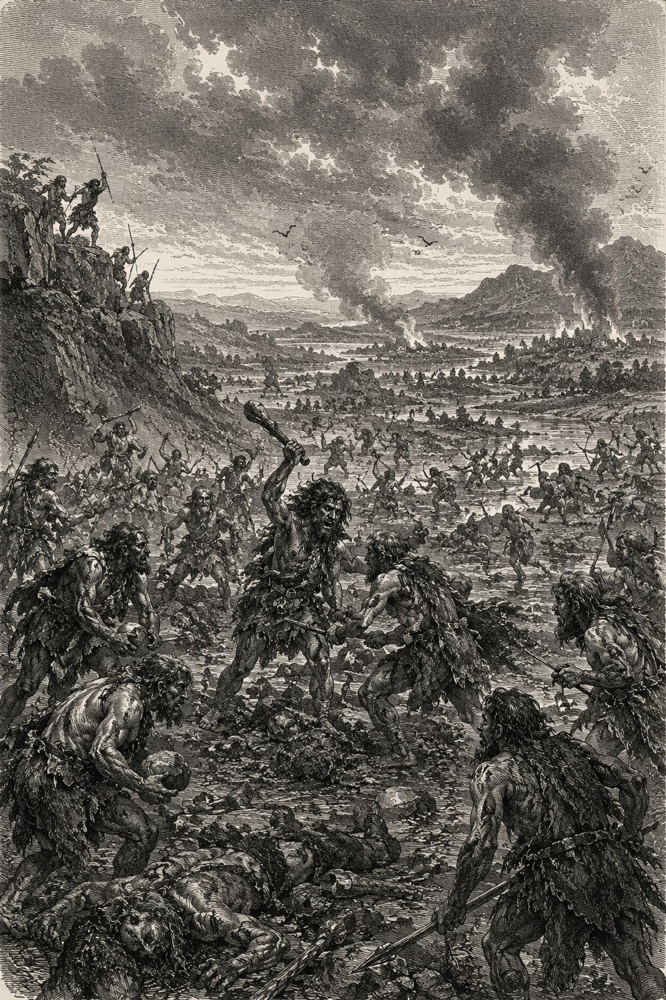

<table>
<tr>
<td width="40%" valign="center">




</td>

<td width="60%" valign="top">


# Samuel Oguntimehin

**Full-Stack Engineer • AI Systems Builder • PL Designer**

Mechanical Engineering graduate building web/mobile appliactions, compilers, AI systems, and decentralized applications.
機械工学卒のエンジニア。Web/モバイルアプリ、コンパイラ、AI、dApps（分散型アプリ）を開発中。

Creator of **Kova**, an AI-integrated programming language with a first-class probabilistic type system for handling uncertainty.

---

## Building

- **Kova** → symbolic AI workflow language with `Prob<T>`, execution graphs, CLI tooling, and live AI integrations.  
  https://github.com/kova-lang/kova

- **NexxiBook** → location-aware booking marketplace for service professionals.  
  `Private Repository`
- **AgentPay OS** → Programmable treasury for agents and businesses.  
  `Launching Soon`
- **PocketBrain** → AI-powered mobile thought capture and voice-note system.  
  `Launching Soon`

---

## Stack

`JavaScript` `TypeScript` `Python` `C++` `Solidity` `Node.js`  
`Next.js` `React Native` `PostgreSQL` `MongoDB` `Prisma`  
`Compiler Design` `ASTs` `Semantic Analysis` `Web3` `AI Systems`

---

## Connect

- LinkedIn: https://linkedin.com/in/samuel-oguntimehin-1636331b3
- Email: oguntimehinsamuel1@gmail.com

---

> Building systems where deterministic software meets probabilistic AI.

</td>
</tr>
</table>
```
